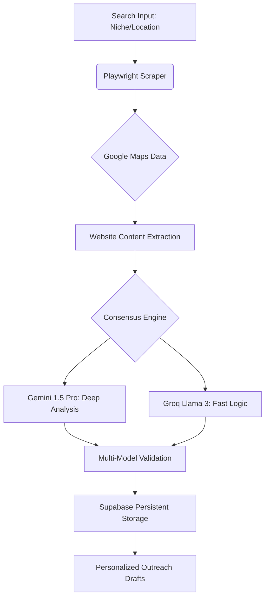

# 🔱 LeadGen-Nexus V2

### Autonomous Multi-LLM Business Intelligence & Outreach Engine

Welcome to **LeadGen-Nexus V2**, your intelligent command-line tool for discovering, analyzing, and reaching out to potential business leads. This tool automates the tedious parts of lead generation so you can focus on dosing deals.

[](https://www.python.org/downloads/)
[](https://supabase.com/)
[](https://ai.google.dev/)
[](https://groq.com/)

**LeadGen-Nexus V2** is a production-grade automation tool designed to bridge the gap between raw web data and high-conversion outreach. Built with a **Consensus-Driven Multi-LLM Architecture**, it ensures hyper-reliable lead analysis while minimizing hallucinations.

---

## 🏗️ System Architecture

---

## 🚀 What Does It Do?

1.  **Discovery**: Scrapes Google Maps to find businesses in a specific niche and location (e.g., "Dentists in Dubai").
2.  **Intelligence**: Analyzes their websites using AI (Gemini 1.5 Pro with Groq fallback) to identify:
    - Core Services
    - Operational Problems (e.g., no booking system, slow site)
    - AI Solutions to fix those problems
3.  **Outreach Prep**: Drafts a personalized, non-salesy cold email for each lead based on the analysis.
4.  **Database**: Saves everything to a Supabase database for easy management.

---

Markdown
# 🔱 LeadGen-Nexus V2
### Autonomous Multi-LLM Business Intelligence & Outreach Engine

[](https://www.python.org/downloads/)
[](https://supabase.com/)
[](https://ai.google.dev/)
[](https://groq.com/)

**LeadGen-Nexus V2** is a production-grade automation tool designed to bridge the gap between raw web data and high-conversion outreach. Built with a **Consensus-Driven Multi-LLM Architecture**, it ensures hyper-reliable lead analysis while minimizing hallucinations.

---

---

🧠 Why Multi-LLM?
In 2026, single-model dependency is a bottleneck. Nexus V2 uses a Dual-Engine approach:

Groq (Llama 3.3): Used for lightning-fast site classification and fallback logic. It's free, blazing fast, and keeps the pipeline moving.

Gemini 1.5 Pro: Used for the "Heavy Lifting"—analyzing business pain points and drafting human-like emails.

Error Minimization: By comparing outputs between both models, the system filters out technical errors and hallucinations before they ever hit your database.

🛠️ Key Technical Features
Fault-Tolerant Scraping: Advanced exception handling for dynamic JS sites.

Persistence Layer: Fully integrated with Supabase (PostgreSQL) for lead tracking and CRM readiness.

Headless Automation: Uses Playwright for stealthy, high-efficiency data collection.


## 🛠️ Prerequisites

Before you start, make sure you have:

- **Python 3.10+** installed.
- **Supabase Account**: You'll need a project URL and Key.
- **API Keys**:
  - `GEMINI_API_KEY` (Google AI Studio)
  - `GROQ_API_KEY` (Groq Cloud)
  - `SUPABASE_URL` and `SUPABASE_KEY`

---

## 📦 Installation

1.  **Clone the valid repository** (if you haven't already):

    ```bash
    git clone <repository-url>
    cd leadgen-nexus-v2
    ```

2.  **Install Python Dependencies**:

    ```bash
    pip install -r requirements.txt
    ```

3.  **Install Playwright Browsers**:
    This is required for the scraper to work.
    ```bash
    playwright install
    ```

---

## ⚙️ Configuration

1.  **Environment Variables**:
    Create a file named `.env` in the project root. You can copy the example:

    ```bash
    cp .env.example .env
    ```

    Fill in your keys:

    ```ini
    GEMINI_API_KEY=your_gemini_key_here
    GROQ_API_KEY=your_groq_key_here
    SUPABASE_URL=your_supabase_url
    SUPABASE_KEY=your_supabase_key
    ```

2.  **Database Setup**:
    - Go to your Supabase Dashboard -> SQL Editor.
    - Copy the contents of `schema.sql`.
    - Run the SQL query to create the `leads` table.

---

## 🏃 Usage

### 1. Run the Lead Generator

The main command requires a niche, location, and a limit on how many _new_ leads to find.

```bash
python main.py --niche "dentist" --location "dubai" --limit 10
````

**What happens next?**

- The browser will open (headless mode) and search Google Maps.
- It will find 10 _new_ leads (skipping duplicates).
- It will then analyze each website and draft an email.
- You'll see a progress bar in the terminal.

### 2. View Results

To quickly see what's in your database:

```bash
python show_leads.py
```

### 3. Manual Processing (Troubleshooting)

If the discovery phase finishes but the analysis stops (or you want to re-process existing leads), run:

```bash
python process_leads.py
```

### 4. Verify Setup

If you're having trouble, run the verification script to check your keys and internet connection:

```bash
python verify_setup.py
```

---

## 🐛 Troubleshooting

- **"Browser not found"**: Run `playwright install` again.
- **"Timeout" or "Element not found"**: Google might be blocking your IP or the page loaded too slowly. Try checking your internet connection.
- **API Errors (404/403)**:
  - Check your `.env` file.
  - Ensure your API keys have credit/quota.
  - The tool automatically tries Groq if Gemini fails.

---

## 📝 License

[Your License Here]
